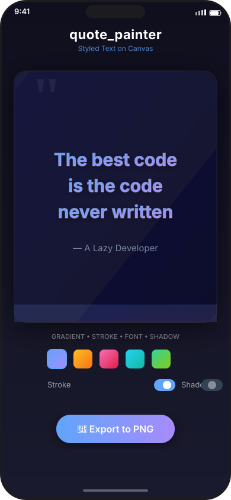

# quote_painter

<p align="center">
  
</p>

Flutter package for rendering styled text on image/video canvas.

## Features

- **Gradient fill** — solid color or `LinearGradient`/`RadialGradient`
- **Stroke (outline)** — configurable width and color per text
- **Shadow** — offset + blur radius
- **Per-line alignment** — left, center, right per `TextLine`
- **Emoji + mixed script** — full Unicode support via Flutter's `TextPainter`
- **Exact positioning** — set `(x, y, width, height)` bounding rect
- **PNG export** — capture to `Uint8List` via `exportToPng`

## Installation

Add to `pubspec.yaml`:

```yaml
dependencies:
  quote_painter:
    git:
      url: https://github.com/govindtank/quote_painter.git
```

Or if published:

```yaml
dependencies:
  quote_painter: ^0.1.0
```

## Usage

```dart
import 'package:flutter/material.dart';
import 'package:quote_painter/quote_painter.dart';

final style = QuoteStyle(
  fontSize: 28,
  gradient: LinearGradient(colors: [Colors.blue, Colors.purple]),
  strokeColor: Colors.white24,
  strokeWidth: 1.0,
  shadowBlurRadius: 4,
);

final lines = [
  TextLine('The best code'),
  TextLine('is the code never written'),
  TextLine('— A Lazy Developer',
      style: LineStyle(fontSize: 16, color: Colors.white54)),
];

// In your widget tree:
QuoteCanvas(
  lines: lines,
  quoteStyle: style,
  width: 350,
  height: 400,
  backgroundDecoration: BoxDecoration(
    gradient: LinearGradient(
      colors: [Color(0xFF1a1a2e), Color(0xFF16213e)],
    ),
  ),
  padding: EdgeInsets.all(32),
);
```

## Export to PNG

```dart
final key = GlobalKey(); // from QuoteCanvas
final bytes = await exportToPng(key, pixelRatio: 3);
// bytes is Uint8List — save to file or share
```

## API Reference

| Class | Purpose |
|-------|---------|
| `QuoteStyle` | Global text config: font size, gradient, stroke, shadow, alignment, line height |
| `LineStyle` | Per-line overrides — color, gradient, fontSize, stroke, shadow, textAlign |
| `TextLine` | A single text string with optional `LineStyle` |
| `QuotePainter` | `CustomPainter` — low-level canvas rendering |
| `QuoteCanvas` | Widget wrapping `QuotePainter` with background decoration and padding |
| `exportToPng` | Capture widget to PNG `Uint8List` |

### QuoteStyle

| Property | Type | Default |
|----------|------|---------|
| `color` | `Color` | `Colors.white` |
| `gradient` | `Gradient?` | `null` |
| `gradientDirection` | `GradientDirection` | `leftToRight` |
| `strokeColor` | `Color` | `Colors.black` |
| `strokeWidth` | `double` | `0.0` |
| `shadowColor` | `Color` | `Colors.black54` |
| `shadowOffset` | `Offset` | `(1.0, 1.0)` |
| `shadowBlurRadius` | `double` | `2.0` |
| `fontSize` | `double` | `24.0` |
| `fontWeight` | `FontWeight` | `FontWeight.w600` |
| `fontStyle` | `FontStyle` | `FontStyle.normal` |
| `fontFamily` | `String?` | `null` |
| `textAlign` | `TextAlign` | `TextAlign.center` |
| `lineHeight` | `double` | `1.4` |
| `letterSpacing` | `double` | `0.0` |

### TextLine

| Parameter | Type | Description |
|-----------|------|-------------|
| `text` | `String` | Text content |
| `style` | `LineStyle?` | Optional per-line style overrides |

### QuoteCanvas

| Parameter | Type | Description |
|-----------|------|-------------|
| `lines` | `List<TextLine>` | Lines to render |
| `quoteStyle` | `QuoteStyle` | Global text style |
| `width` | `double` | Canvas width |
| `height` | `double` | Canvas height |
| `backgroundColor` | `Color?` | Solid background color |
| `backgroundDecoration` | `BoxDecoration?` | Full background decoration (gradient, border, etc.) |
| `padding` | `EdgeInsetsGeometry` | Padding inside canvas (default: `EdgeInsets.zero`) |
